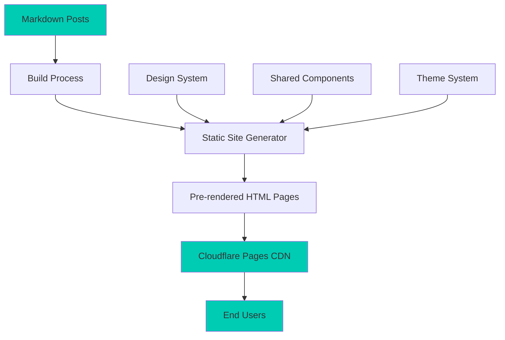

# Design Document

## Overview

The blog site will be a standalone SvelteKit application that mirrors the visual design, component architecture, and user experience of the existing portfolio site. The architecture prioritizes static site generation for optimal performance on Cloudflare Pages, with all blog posts pre-rendered at build time from markdown files.

The design focuses on three core principles:
1. **Visual Consistency**: Exact replication of the portfolio site's design system
2. **Content-First Architecture**: Markdown-based content management with frontmatter metadata
3. **Static Performance**: Full static generation with no server-side rendering

## Architecture

### High-Level Architecture



### Directory Structure

```
blog-site/
├── src/
│   ├── lib/
│   │   ├── components/          # Shared UI components
│   │   │   ├── NavBar.svelte
│   │   │   ├── Footer.svelte
│   │   │   ├── PostCard.svelte
│   │   │   ├── SearchBar.svelte
│   │   │   ├── ThemeSwitcher.svelte
│   │   │   ├── Button.svelte
│   │   │   ├── TagBadge.svelte
│   │   │   └── Heading.svelte
│   │   ├── styles/              # Design system styles
│   │   │   ├── color-palette.scss
│   │   │   ├── typography.scss
│   │   │   ├── dimensions.scss
│   │   │   └── media-queries.scss
│   │   ├── stores/              # State management
│   │   │   ├── ThemeStore.ts
│   │   │   └── PostStore.ts
│   │   ├── utils/               # Helper functions
│   │   │   ├── markdown.ts
│   │   │   ├── post-utils.ts
│   │   │   └── search.ts
│   │   └── types/               # TypeScript types
│   │       ├── Post.ts
│   │       └── Config.ts
│   ├── routes/
│   │   ├── +layout.svelte       # Root layout with nav/footer
│   │   ├── +page.svelte         # Home page (recent posts)
│   │   ├── +page.ts             # Load all posts
│   │   ├── posts/
│   │   │   └── [slug]/
│   │   │       ├── +page.svelte # Individual post page
│   │   │       └── +page.ts     # Load single post
│   │   ├── archive/
│   │   │   ├── +page.svelte     # Archive page
│   │   │   └── +page.ts         # Load posts by date
│   │   ├── categories/
│   │   │   ├── +page.svelte     # All categories
│   │   │   └── [tag]/
│   │   │       ├── +page.svelte # Posts by tag
│   │   │       └── +page.ts     # Filter posts
│   │   └── about/
│   │       └── +page.svelte     # About the blog
│   ├── posts/                   # Markdown blog posts
│   │   ├── 2024-01-15-first-post.md
│   │   ├── 2024-02-20-second-post.md
│   │   └── ...
│   └── app.html                 # HTML template
├── static/                      # Static assets
│   ├── fonts/
│   └── images/
├── svelte.config.js
├── vite.config.js
└── package.json
```

## Components and Interfaces

### Core Components

#### 1. NavBar Component
Identical to portfolio site navigation with blog-specific links.

**Props:**
- `color: string` - Accent color for active link

**Features:**
- Responsive layout (horizontal on desktop, vertical on mobile)
- Active route highlighting
- Theme switcher integration
- Same hover effects and transitions

**Implementation Notes:**
- Copy exact component from portfolio site
- Update route links to: Home, Archive, Categories, About
- Maintain same styling and behavior

#### 2. PostCard Component
Displays blog post preview in grid layout.

**Props:**
- `post: Post` - Post object with metadata
- `featured?: boolean` - Optional featured styling

**Structure:**
```typescript
interface Post {
  slug: string;
  title: string;
  date: string;
  excerpt: string;
  tags: string[];
  author?: string;
  thumbnail?: string;
  featured?: boolean;
}
```

**Styling:**
- Same card background and border as portfolio site
- Hover effect: scale(1.02) with subtle shadow
- Grid layout: 1 column (mobile), 2 columns (tablet), 3 columns (desktop)

#### 3. SearchBar Component
Real-time search functionality for posts.

**Props:**
- `posts: Post[]` - All available posts
- `onSearch: (results: Post[]) => void` - Callback with filtered results

**Features:**
- Debounced search input (300ms)
- Searches title, excerpt, tags, and content
- Highlights matching terms
- Clear button when query exists

**Styling:**
- Input field with card background
- Same border and focus states as portfolio site
- Search icon using Icon component

#### 4. ThemeSwitcher Component
Exact copy of portfolio site theme switcher.

**Features:**
- Dropdown with three theme options: Dark, Light, Callisto
- Persists selection to localStorage
- Updates CSS variables immediately
- Same icon and styling

#### 5. TagBadge Component
Displays post tags with consistent styling.

**Props:**
- `tag: string` - Tag name
- `clickable?: boolean` - Whether tag is clickable

**Styling:**
- Same as portfolio site LangBadge component
- Accent color background
- Rounded corners (4px)
- Hover effect if clickable

#### 6. MarkdownRenderer Component
Renders markdown content with syntax highlighting.

**Props:**
- `content: string` - Raw markdown content

**Features:**
- Parses markdown to HTML
- Syntax highlighting for code blocks
- Responsive images
- Same heading styles as portfolio site

### Page Components

#### Home Page (`/`)
**Layout:**
- Hero section with site title and description
- Search bar
- Grid of recent posts (12 most recent)
- "View All Posts" button linking to archive

**Data Loading:**
- Load all posts at build time
- Sort by date descending
- Extract metadata from frontmatter

#### Post Page (`/posts/[slug]`)
**Layout:**
- Post header with title, date, author, tags
- Markdown content with proper typography
- "Back to Posts" navigation
- Related posts section (same tags)

**Data Loading:**
- Load single post by slug
- Parse markdown and frontmatter
- Generate static page for each post

#### Archive Page (`/archive`)
**Layout:**
- All posts grouped by year and month
- Chronological order (newest first)
- Post count per month

**Data Loading:**
- Load all posts
- Group by publication date

#### Categories Page (`/categories`)
**Layout:**
- List of all tags with post counts
- Grid of posts when tag selected
- Tag cloud visualization

**Data Loading:**
- Extract all unique tags
- Count posts per tag
- Filter posts by selected tag

## Data Models

### Post Type
```typescript
interface Post {
  slug: string;           // URL-friendly identifier
  title: string;          // Post title
  date: string;           // Publication date (ISO format)
  excerpt: string;        // Short description
  tags: string[];         // Category tags
  content: string;        // Full markdown content
  author?: string;        // Author name (optional)
  thumbnail?: string;     // Featured image URL (optional)
  featured?: boolean;     // Featured post flag (optional)
  readingTime?: number;   // Estimated reading time in minutes
}
```

### Frontmatter Schema
```yaml
---
title: "Post Title"
date: "2024-01-15"
excerpt: "Brief description of the post content"
tags: ["technology", "tutorial", "sveltekit"]
author: "Skye Fugate"
thumbnail: "/images/post-thumbnail.jpg"
featured: false
---
```

### Config Type
```typescript
interface BlogConfig {
  title: string;
  author: string;
  description: string;
  baseUrl: string;
  postsPerPage: number;
  defaultTheme: 'dark' | 'light' | 'callisto';
  navLinks: NavLink[];
  social: SocialLinks;
}

interface NavLink {
  label: string;
  route: string;
  color: string;
  description?: string;
}
```

## Design System

### Color Palette
Exact replication of portfolio site color variables:

```scss
// Callisto Theme (Default)
--background: #020617;
--foreground: #dcdcdc;
--dimmed-text: #8892b0;
--card-background: #0b1021;
--card-border: 1px solid #ffffff1a;
--accent-1: #00ccb4;
--accent-2: #00ccb4;
--accent-3: #00ccb4;
--accent-4: #00ccb4;

// Dark Theme
--background: #101010;
--foreground: #fafafa;
--dimmed-text: #808080;
--card-background: #1b1b1b;
--card-border: 1px solid #2a2a2a;

// Light Theme
--background: #ededed;
--foreground: #2a3367;
--card-background: #F8F8FF;
--card-border: 1px solid #0000001a;
```

### Typography
```scss
// Font Families
--font-primary: 'Poppins', sans-serif;
--font-mono: 'FiraCode', monospace;
--font-display: 'RedHatText', sans-serif;

// Font Sizes
--text-xs: 0.75rem;
--text-sm: 0.875rem;
--text-base: 1rem;
--text-lg: 1.125rem;
--text-xl: 1.25rem;
--text-2xl: 1.5rem;
--text-3xl: 1.875rem;
--text-4xl: 2.25rem;

// Font Weights
--font-normal: 400;
--font-medium: 500;
--font-semibold: 600;
--font-bold: 700;
--font-extrabold: 800;
```

### Spacing and Layout
```scss
// Grid System
--grid-item-width: 20rem;
--grid-item-spacing: 1rem;
--grid-max-width: 100rem;

// Border Radius
--curve-factor: 4px;

// Spacing Scale
--space-1: 0.25rem;
--space-2: 0.5rem;
--space-3: 0.75rem;
--space-4: 1rem;
--space-6: 1.5rem;
--space-8: 2rem;
```

### Component Patterns

#### Button Styles
```scss
.button {
  padding: 0.25rem 0.5rem;
  border-radius: 4px;
  font-family: RedHatText;
  font-size: 1.2rem;
  filter: grayscale(15%);
  transition: all 0.2s ease-in-out;
  
  &:hover {
    filter: grayscale(0%);
    transform: scale(1.05) rotate(1deg);
  }
  
  &.primary {
    background: var(--accent);
    color: var(--background);
    font-weight: bold;
  }
}
```

#### Card Styles
```scss
.card {
  background: var(--card-background);
  border: var(--card-border);
  border-radius: var(--curve-factor);
  padding: var(--space-4);
  transition: transform 0.2s ease-in-out;
  
  &:hover {
    transform: scale(1.02);
  }
}
```

#### Link Styles
```scss
a {
  color: var(--accent);
  text-decoration: none;
  border-radius: 4px;
  padding: 0.1rem 0.25rem;
  
  &:hover {
    background: var(--accent);
    color: var(--background);
  }
}
```

## Markdown Processing

### Parser Configuration
Use `marked` library with custom renderer for:
- Syntax highlighting (using `highlight.js`)
- Custom heading IDs for anchor links
- Responsive image sizing
- External link handling (target="_blank")

### Code Block Styling
```scss
pre code {
  font-family: var(--font-mono);
  font-size: 0.9rem;
  line-height: 1.5;
  background: var(--card-background);
  border: var(--card-border);
  border-radius: var(--curve-factor);
  padding: var(--space-4);
  overflow-x: auto;
}
```

### Reading Time Calculation
```typescript
function calculateReadingTime(content: string): number {
  const wordsPerMinute = 200;
  const wordCount = content.split(/\s+/).length;
  return Math.ceil(wordCount / wordsPerMinute);
}
```

## Search Implementation

### Search Algorithm
```typescript
interface SearchOptions {
  query: string;
  posts: Post[];
  fields: ('title' | 'excerpt' | 'tags' | 'content')[];
}

function searchPosts(options: SearchOptions): Post[] {
  const { query, posts, fields } = options;
  const lowerQuery = query.toLowerCase();
  
  return posts.filter(post => {
    return fields.some(field => {
      const value = post[field];
      if (Array.isArray(value)) {
        return value.some(item => 
          item.toLowerCase().includes(lowerQuery)
        );
      }
      return value?.toLowerCase().includes(lowerQuery);
    });
  });
}
```

### Search UI Flow
1. User types in search input
2. Debounce 300ms to avoid excessive filtering
3. Filter posts by query across all fields
4. Update displayed posts with results
5. Show "No results" message if empty
6. Highlight matching terms in results

## Error Handling

### 404 Page
Custom 404 page matching portfolio site styling:
- "Post Not Found" message
- Search bar to find other posts
- Links to home and archive pages
- Same layout and styling as other pages

### Build-Time Validation
```typescript
function validatePost(post: Post): ValidationResult {
  const errors: string[] = [];
  
  if (!post.title) errors.push('Title is required');
  if (!post.date) errors.push('Date is required');
  if (!post.excerpt) errors.push('Excerpt is required');
  if (!post.tags || post.tags.length === 0) {
    errors.push('At least one tag is required');
  }
  
  return {
    valid: errors.length === 0,
    errors
  };
}
```

### Graceful Degradation
- If thumbnail missing, use default placeholder
- If author missing, use config default
- If reading time calculation fails, omit display
- If search fails, show all posts

## Testing Strategy

### Unit Tests
- Post parsing and frontmatter extraction
- Search algorithm accuracy
- Reading time calculation
- Date formatting utilities
- Tag extraction and grouping

### Component Tests
- PostCard rendering with various props
- SearchBar filtering behavior
- ThemeSwitcher state management
- TagBadge click handling
- MarkdownRenderer output

### Integration Tests
- Full page rendering for each route
- Navigation between pages
- Theme persistence across sessions
- Search results accuracy
- Post filtering by tag

### Visual Regression Tests
- Compare screenshots with portfolio site
- Verify color consistency across themes
- Check responsive layouts at breakpoints
- Validate hover states and animations

### Build Tests
- Verify all posts generate static pages
- Check for broken internal links
- Validate frontmatter schema
- Ensure proper asset copying

## Performance Considerations

### Static Generation
- All pages pre-rendered at build time
- No server-side rendering overhead
- Instant page loads from CDN

### Asset Optimization
- Font subsetting for faster loads
- Image optimization and lazy loading
- CSS purging to remove unused styles
- JavaScript code splitting by route

### Caching Strategy
- Static assets cached indefinitely
- HTML pages cached with revalidation
- Service worker for offline support (optional)

### Bundle Size Targets
- Initial JS bundle: < 50KB gzipped
- CSS bundle: < 20KB gzipped
- Per-route chunks: < 30KB gzipped

## Deployment Configuration

### Cloudflare Pages Setup
```javascript
// svelte.config.js
import cloudflareAdapter from '@sveltejs/adapter-cloudflare';

export default {
  kit: {
    adapter: cloudflareAdapter(),
    prerender: {
      entries: ['*'],
      crawl: true
    }
  }
};
```

### Build Command
```json
{
  "scripts": {
    "build": "DEPLOY_TARGET=CLOUDFLARE vite build"
  }
}
```

### Environment Variables
- `PUBLIC_SITE_URL`: Base URL for the blog
- `PUBLIC_ANALYTICS_ID`: Analytics tracking ID (optional)

### Routing Configuration
Create `_redirects` file for client-side routing:
```
/*    /index.html   200
```

## Migration Path

### Phase 1: Setup and Core Structure
1. Initialize new SvelteKit project
2. Copy design system files from portfolio site
3. Set up static adapter and build configuration
4. Create basic directory structure

### Phase 2: Component Development
1. Copy and adapt shared components (NavBar, Footer, Button, etc.)
2. Create blog-specific components (PostCard, SearchBar, etc.)
3. Implement theme system with store
4. Build markdown processing pipeline

### Phase 3: Page Implementation
1. Create home page with post grid
2. Build individual post page with markdown rendering
3. Implement archive page with date grouping
4. Create categories page with tag filtering

### Phase 4: Content and Testing
1. Create sample blog posts
2. Test all routes and navigation
3. Verify theme switching
4. Test search functionality
5. Validate responsive layouts

### Phase 5: Deployment
1. Configure Cloudflare Pages
2. Set up build pipeline
3. Deploy to production
4. Verify all functionality in production

## Future Enhancements

### Potential Features (Not in Initial Scope)
- RSS feed generation
- Social sharing buttons
- Comments system integration
- Newsletter subscription
- Related posts algorithm
- Table of contents for long posts
- Dark mode for code blocks
- Reading progress indicator
- Post series/collections
- Author pages (multi-author support)
